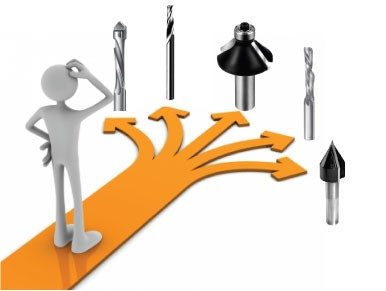

:title: ۹۷ چیز که یک برنامه نویس بهتر است بدانند
:author: عباس یزدان پناه
:description: این یک پرزنتیشن تست است
:keywords: presentation, restructuredtext, impress.js, tutorial
:css: 97thing.css

----

.. raw:: html

	<h2>باسمه تعالی</h2>

۹۷ چیز که یک برنامه نویس بهتر است بداند
=========================================================

عباس یزدان‌پناه - blog.abyz.ir
------------------------------

.. image:: images/hive_ir_logo.png
	:width: 150px

----

«۱۰»
=====

ابزارهای خود را به دقت انتخاب کنید
===========================================

Choose Your Tools with Care
----------------------------------------------------
By Giovanni Asproni
--------------------
فصل‌هایی که من با اونها آشنا بودم اول ضبط شدن. ازتون دعوت میکنم هر کدوم رو دوست داشتید ضبط کنید.

----

نرم افزارهای مدرن
==================

توسعه از ابتدا؟!؟!

- افزایش سایز و پیچیدگی نرم افزار 
- کاهش زمان توسعه
- ترجیح کد مرتبط با کسب و کار بجای زیرساخت‌ها

.. image:: images/Tools-image.jpg
	:width: 500px

----

نرم افزارهای مدرن
==================

- کتابخانه‌های معروف =باگ‌های کمتر
- نرم افزارهای با کیفیت مجانی  = زمان توسعه کمتر و متخصص بیشتر
- تولید و نگهداری نیازمند نیروی انسانی پر هزینه

----

انتخاب ابزارها
===============

- پیش‌فرضهای متفاوت ابزارهای مختلف   
- پیکربندی‌های متفاوت و پیچیده       
- نرم‌افزار آزاد مجانی نیست          
- چرخه حیات متفاوت ابزارها
- وابستگی به یک شرکت
- لیسانس نرم‌افزار

----

حال چه کنیم
============

- حداقل ابزارها
- حل مسائل زیرساختی
- اضافه کردن ابزارها با پیش‌آمدن نیاز
- جدا کردن لایه کسب و کار از کتابخانه‌ها

----

نتیجه کد کوچک با حداقل وابستگی خارجی
=====================================

----

blog.abyz.ir
============

.. image:: images/hive_ir_logo.png
	:width: 150px

.. raw:: html
	
	

	yazdanpanaha
	yazdan
	

