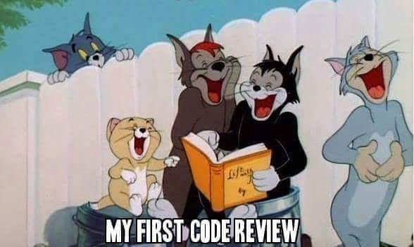

:title: ۹۷ چیز که یک برنامه نویس بهتر است بدانند
:author: عباس یزدان پناه
:description: این یک پرزنتیشن تست است
:keywords: presentation, restructuredtext, impress.js, tutorial
:css: 97thing.css

----

.. raw:: html

	<h2>باسمه تعالی</h2>

۹۷ چیز که یک برنامه نویس بهتر است بداند
=========================================================

عباس یزدان‌پناه - blog.abyz.ir
------------------------------

.. image:: images/hive_ir_logo.png
	:width: 150px

----

«۱۴»
=====

بررسی کد
===========================================

Code Review
----------------------------------------------------
by Mattias Karlsson
---------------------

فصل‌ها به ترتیب ضبط نشدن و اونهایی که باهاشون برخورد داشتم، اول ضبط شدن.

----

کدها را بررسی کنید
============================

- افزایش کیفیت کد
- کاهش نرخ ایرادات

.. image:: images/code-review.png

----

تجربه بد گذشته
=================

- بررسی کد: رسمی و خشک
- بررسی توسط معمار یا برنامه‌نویس ارشد
- بررسی کد دلیل ناکارآمدی
- بررسی کد = قضاوت شدن
- بررسی‌کنندگان آگاه به همه زیر و بم‌های کد
- بررسی‌کنندگان گلوگاه کارایی

----

اهداف بررسی
============

- نباید تنها رفع ایرادات باشد
- اشتراک دانش
- پیدا کردن خط‌مشی‌های کدنویسی
- احساس مالکیت جمعی
- یکی از اعضای تیم بصورت تصادفی
	- یادگرفتن و فهمیدن کد بجای یافتن ایرادها

.. image:: images/over-the-shoulder-code-review.png
	:width: 350px	
	:class: left-image

----

در حین بررسی
=============
- مهربان باشید
- نظرات سازنده نه کوبنده
- قوانین جدید برای بررسی
	* جلوگیری از بزرگ‌شدن نقش قدیم‌ترها
	* پخش مسئولیت‌ها بین اعضا مثلا بررسی کارکردها، مستندات

----

جلسات بررسی
============

- جلسات مستمر مثلا هفتگی
- حداقل به مدت چند ساعت 
- تغییر فرد درحال بررسی و نقش‌ها
- درگیر کردن تازه‌کارها
- درگیر کردن باتجربه‌ها
- بررسی با داشتن code convention راحت‌تر میشود.

----

مهمترین‌کار
============

- جلسه بررسی را لذت‌بخش کنید
- لذت‌بردن مهم‌ترین عامل موفقیت
- بررسی کردن کار آدم‌ها پس آنها را در نظر بگیرید
- بررسی غیر رسمی به هدف یادگیری

----

نظرات نیش‌دار را بیرون از جلسه بررسی گذاشته و کیک و خوراکی به جلسه بیاورید.
===========================================================================

----

blog.abyz.ir
============

.. image:: images/hive_ir_logo.png
	:width: 150px

.. raw:: html
	
	

	yazdanpanaha
	yazdan
	

