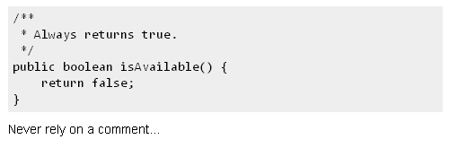
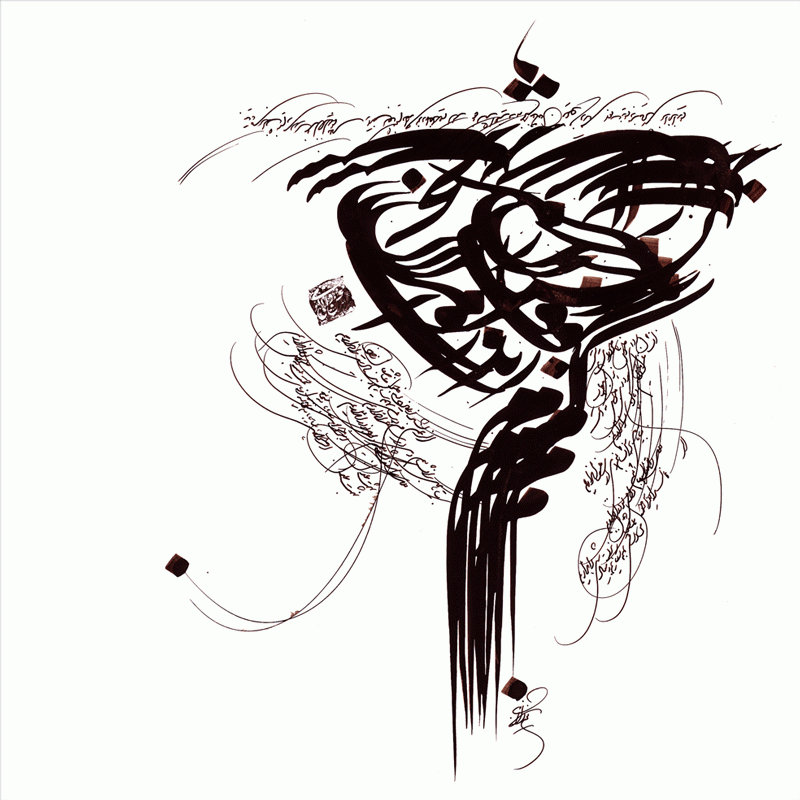

:title: ۹۷ چیز که یک برنامه نویس بهتر است بدانند
:author: عباس یزدان پناه
:description: این یک پرزنتیشن تست است
:keywords: presentation, restructuredtext, impress.js, tutorial
:css: 97thing.css

----

:data-x: r2000
:class: justheader

.. raw:: html

	<h2>باسمه تعالی</h2>

۹۷ چیز که یک برنامه نویس بهتر است بداند
=========================================================

عباس یزدان‌پناه - blog.abyz.ir
------------------------------

.. image:: images/hive_ir_logo.png
	:width: 150px

----

:class: justheader

«۱۶ و ۱۷»
===========	

کامنتی در مورد کامنت‌ها - کامنت در مورد آنچه کد نمی‌گوید
========================================================

A Comment on Comments - Comment Only What the Code Cannot Say
-------------------------------------------------------------------------
by Cal Evans - Kevlin Henney
------------------------------------

فصل‌ها به ترتیب ضبط نشدن و اونهایی که باهاشون برخورد داشتم، اول ضبط شدن.

----

تجربه شخصی
============

- داستان نویسنده
- نگهداری کد دیگران
- خواندن کدهای متن باز

----

کامنت‌های جهنمی؟
===================

- آیا کامنت‌ها بد ذات هستند؟
- آیا وقت و انرژی ما را به هدر می‌دهند؟

----

کامنت‌ها همانند ساختارهای زبان
================================

- کامنت بخشی ساختارهای کنترلی و سایز ابزارهای زبان برنامه نویسی 
- ابزارهای تولید مستندات مثل: 
	* doxygen
	* javadocs 
	* sphinex
- مستندات را بصورت اتوماتیک تولید کنید

.. image:: images/doxygen.png
	:width: 300px
	:class: left-image

----

آن خطاط ! نیستیم
===================

- داستان آن خطاط که سه گونه خط نوشتی
- کدهای ما نبایستی چون به سختی نوشته شده به سختی خوانده شود.
- کامنتها را برای خود آینده‌تان، همکارانتان، تازه‌واردان بنویسید.

----

تفریط!
============

- دام تفریط و زیاده‌روی
- کامنت‌های روشنگر بجای پیچیده کننده
- کدتان را با کامنت‌هایتان تزئین کنید
- کامنتهای هدر باید به خواننده امکان استفاده از کد را بدون خواندن بدهد
- کامنت‌های متن بایستی راه‌گشای درست کردن یا توسعه کد باشد.

----

بدانیم کی کامنت ننویسیم
==============================

- کیفیت و درستی ساختاری کد همیشه مشخص و قابل کشف است
- کیفیت و درستی کارکرد کد نیز با تست و استفاده خودش را نشان می‌دهد
- اما کیفیت کامنت‌های چطور؟

----

انواع کامنت
=============

- کامنت‌های غلط
	* بی‌ارزش یا گمراه کننده
	* مانا هستند
	* منبع گمراهی و سردرگمی
- کامنت‌های درست بی ارزش
	* نویز هستند
- کدهای کامنت شده

----

نتیجه کامنت‌های زیاد
=======================

- منجر به در نظر گرفتن کل کامنت‌ها می‌شود.
	* بستن کامنت‌ها
	* پاک کردن آنها
	* همرنگ کردن آنها با پس‌زمینه
- از دست رفتن اطلاعات ارزشمند کامنت‌ها

----

کامنتهای کارا
===============

- واضحات را توضیح نمی‌دهند
- بخش‌های مغفول مانده را می‌گویند.
- سعی کنید کد را واضح کنید.  

----

:class: justheader

کامنت‌های کارآمد بگذارید و کامنتی نگذارید که مانع پیشرفت کاریتان شود
=====================================================================

سعی کنید با بهبود ساختار کد از نوشتن کامنت‌های اضافه دوری کنید
==============================================================

----

:class: justheader

blog.abyz.ir
============

.. image:: images/hive_ir_logo.png
	:width: 150px

.. raw:: html
	
	

	yazdanpanaha
	yazdan
	

