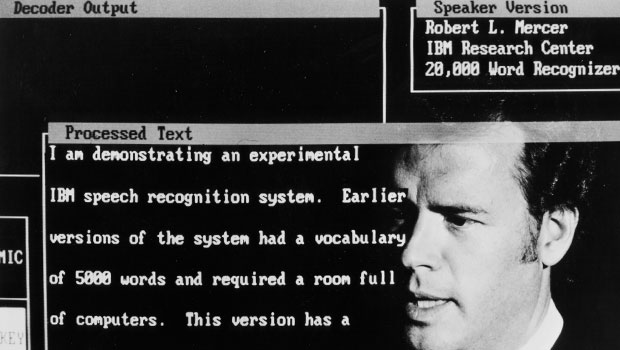
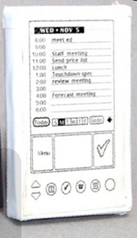
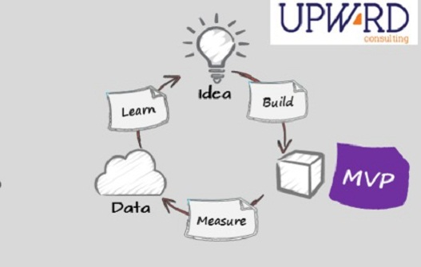
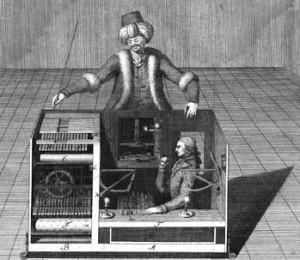
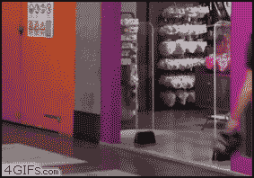

:title: کمینه محصول پذیرفتی
:author: عباس یزدان پناه
:description: این ارائه در رویداد هکوان در تاریخ ۱۹ اسفند ارائه شده است
:keywords: presentation, hackone, fintechfest, mvp, pretotyping
:css: hackone.css

----

.. raw:: html

	<h2>باسمه تعالی</h2>

کمینه محصول پذیرفتنی
=========================================================

عباس یزدان‌پناه 
------------------------------

.. image:: images/noavari.png
	:width: 500px

----

مقدمه
===========================================

«اگر شما از اولین نسخه محصول خود خجالت نمی‌کشید و به آن افتخار می‌کنید شما خیلی دیر نسخه اولیه را ارائه کرده‌اید» رید هافمن

- محصول ما، محصول برنده؟
- دل را به دریا زدن
- آیا کسی از آن استفاده خواهد کرد؟

----

از دو منبع
==================

- کتاب «پیش‌نمونه سازی» از آلبرتو ساویا
- کتاب «lean startup»

----

داستان‌ها
==================

- در هریک از این کتاب‌ها نمونه‌ها و داستان‌هایی ارائه شده
- روش‌ها از کارهایی که توسط کارآفرینان انجام شده الهام گرفته شده

----

دراپ باکس
========================

- نمونه اولیه پیچیده 
- هزینه زمانی و مالی زیاد
- راه حل ارائه شده یک ویدئو که نحوه کار را توصیف میکرد
- نزدیک به ۵۰ هزار نفر پیش ثبت‌نام

.. image:: images/dropbox.jpg
	:width: 400px

----

تبدیل گفتار به متن IBM
========================

- مساله باز علمی
- سالها هزینه و تلاش
- یک راه‌حل هوشمندانه

----

پالم پایلوت
========================

- جف هاوکینز یک مهندس خلاق
- محصول قبلی: اعجاز مهندسی اما یک شکست تجاری بزرگ
- نمی‌دانست که دیگران از آن استفاده خواهند کرد؟
- تظاهر کرد

----

شکست اجتناب ناپذیر
====================

- بسیاری از ایده‌های نو شکست می‌خورند.
- قانون شکست: «اکثر چیزهای جدید شکست می‌خورند، فارغ از اینکه چقدر بی نقص اجرا شده باشند.»
- غول شکست در کمین ماست

----

سرزمین فکر
============

- در ذهن ماست
- ساکنان: ایده‌ها و نظرات
- هر دو انتزاعی هستند
- امنیت برای ایده‌ها و خطرناک برای سازندگان
- اثر نامتناسب نظرات منفی

----

انواع شکست
===========

- کاری انجام ندادن
- ساختن محصول اولیه
- امتحان کردن

----

تفاوت نمونه‌اولیه با mvp
=========================

- هدف‌های متفاوت
- نمونه اولیه: آیا می‌توانیم آنرا بسازیم؟
- mvp : آیا محصول درستی برای ساختن است؟

.. image:: images/mvp-prototype.jpg	
	:width: 400px
	:class: left-image

----

چرخه اصلاح
===========

1. بسازید
2. اندازه بگیرید
3. یادبگیرید
4. به یک برگردید

----

روش‌ها
=====================

- روش‌های متفاوت برای تست یک ایده
- محصولات متفاوت و نیازهای متفاوت

----

کمینه محصول پذیرفتنی
========================

- محصولی که لاغر شده است
- حداقل ویژگی‌ها را دارد
- بدون اثری از آثار ایده‌آل گرایی
- کوچک: فقط ویژگی‌‌های اساسی باقی بماند.

.. image:: images/mvp.png
	:width: 400px
	:class: left-image

----

ترک میکانیکی - خدمت کار
========================

- یک روش سرگرمی قدیمی
- همه کارها توسط انسان انجام می‌شود.
- در ظاهر همه چیز اتوماتیک است

----

پینوکیو
========================

- نسخه غیر عملیاتی و «مرده» محصول خود را بسازید.
- سایز، شکل، وزن، حمل پذیری و غیره مهم است

.. image:: images/pinokio.png
	:width: 150px
	:class: left-image

----

استانی
========================

- بصورت محلی عمل کنید
- زیر مجموعه از اهداف خود
-  ساده سازی روند توسعه نرم‌افزار

----

در جعلی
========================

- یک «ورودی» جعلی برای محصولی که اصلا وجود خارجی ندارد بسازید.
- یک «مدخل» یا «ورودی» برای یک محصول(یا ویژگی) بالقوه است. 
- سنجش میزان علاقه

----

وانمود کنید که دارید
========================

- قبل از سرمایه گذاری برای خرید هر چیزی که برای چیزتان به آن نیاز دارید، آنرا قرض گرفته یا اجاره کنید.
- تا زمانی که مطمئن نیستید یک چیز درست را دارید همه چیز را ارزان تمام کنید.

----

معیار ارزیابی
========================
- سطح علاقه اولیه
- سطح علاقه مداوم
- سطح پایه، بهبود، ادامه یا چرخش
- تحلیل cohort یا تجمعی

----

بروید و بسازید
========================

----

fintechfest.ir - pretotyping.ir
================================

.. image:: images/noavari.png
	:width: 500px

.. raw:: html
	
	

	yazdanpanaha
	yazdan
	

