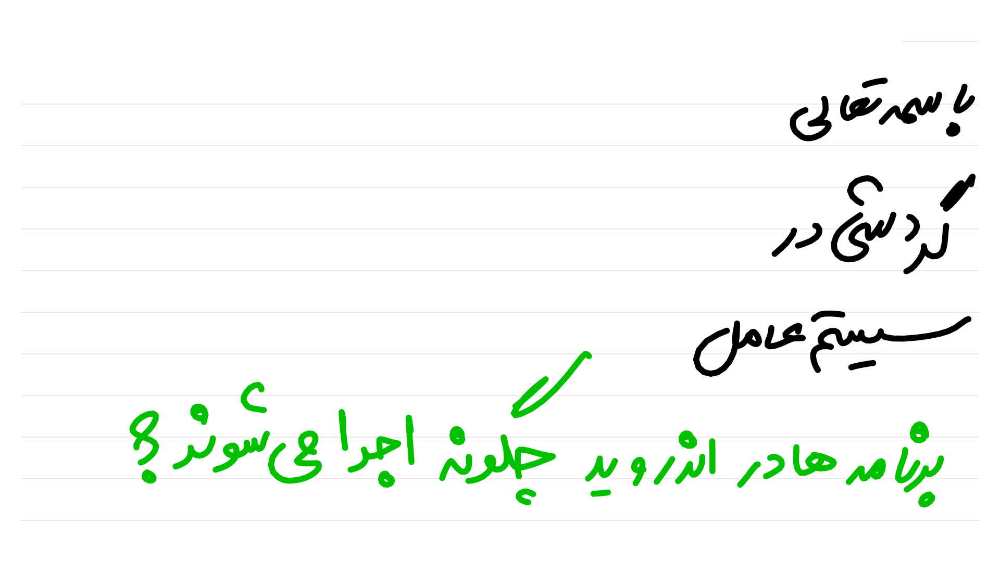
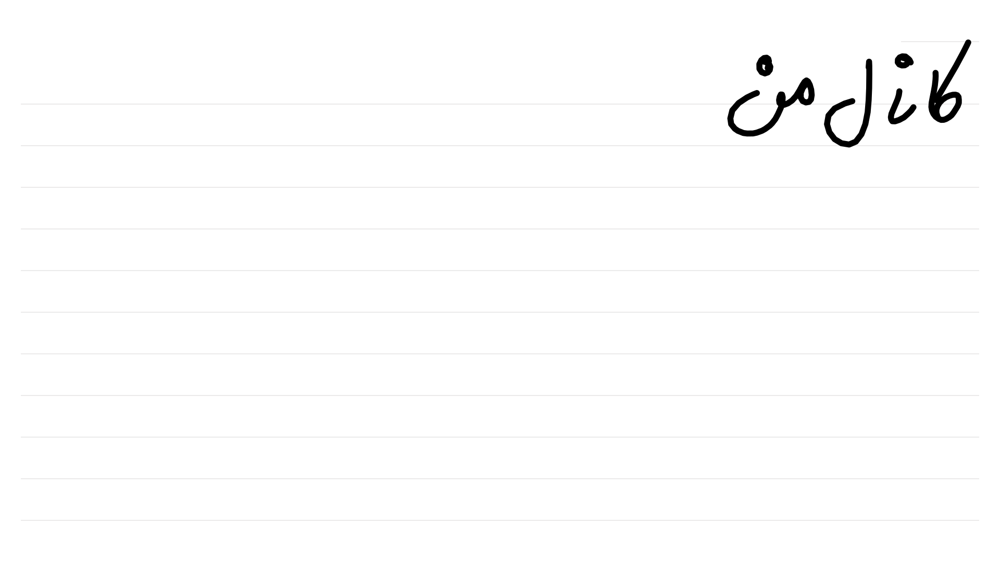
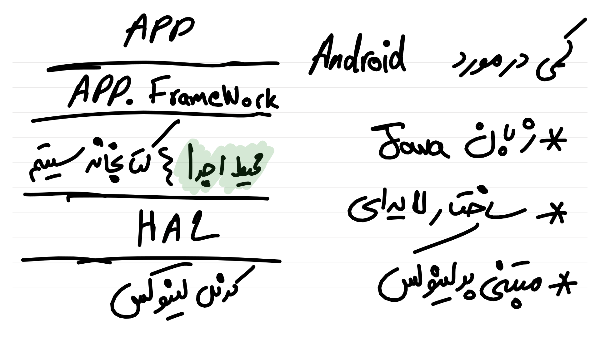
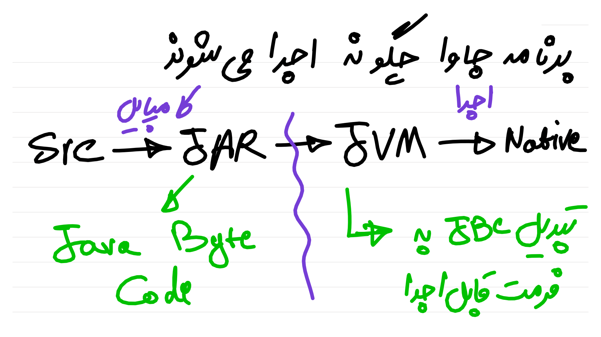
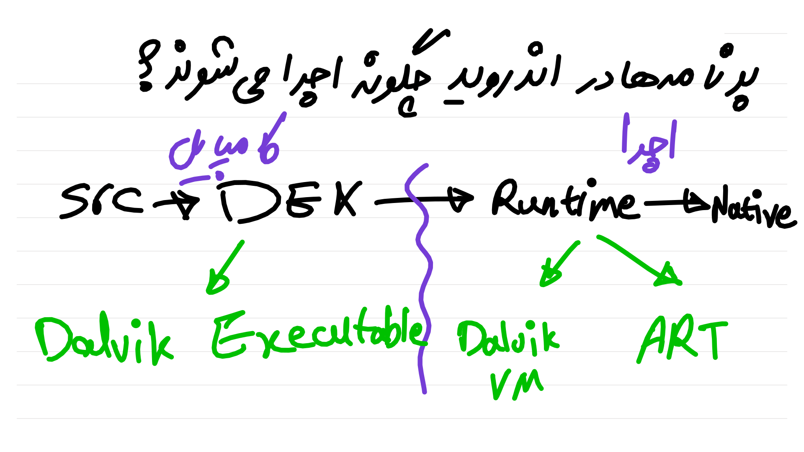
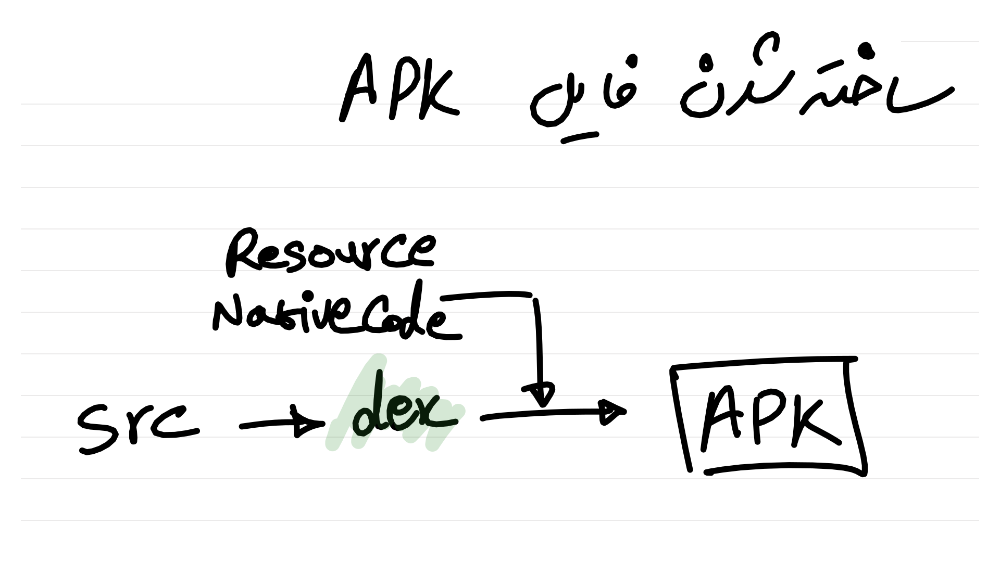
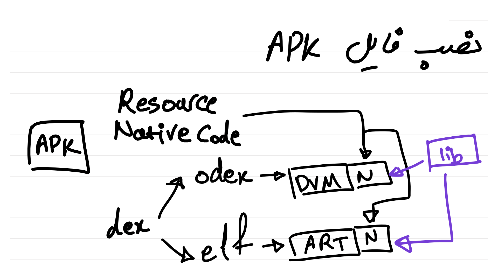
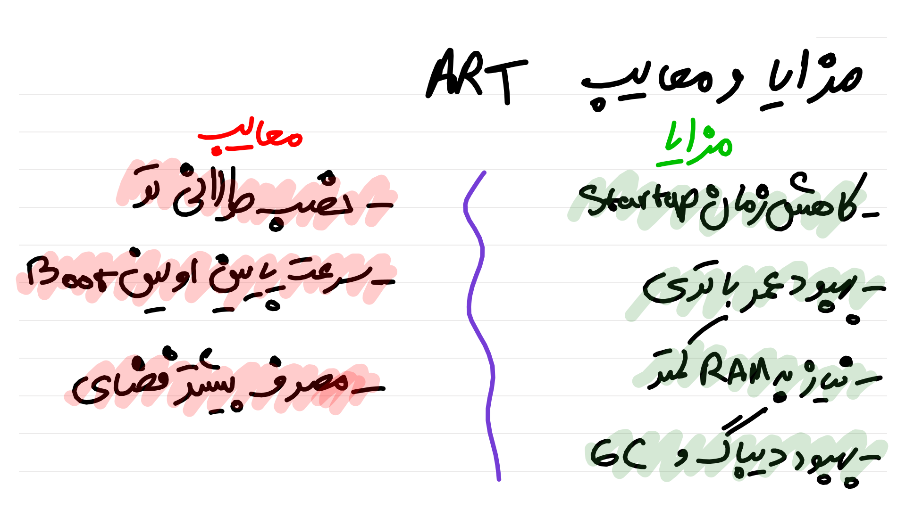
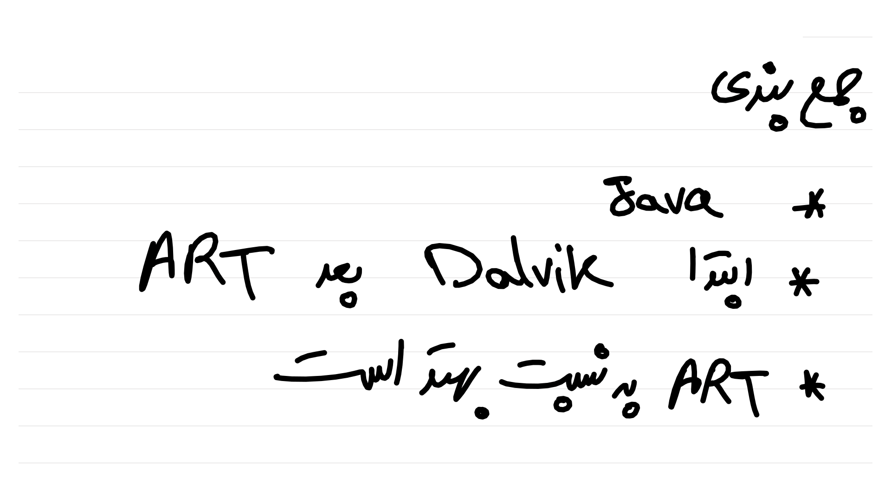
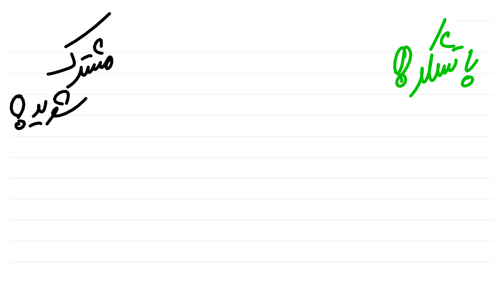

:title: گردشی در سیستم عامل
:author: عباس یزدان پناه
:description: این سری ارائه مقدماتی در مورد سیستم عامل است
:keywords: presentation, youtube, os, crash course
:css: os.css

----

:data-x: r2000

----

----

----

:data-x: r0
:data-y: r1080

----

----

:data-x: r2000
:data-y: 0

----

:data-x: r0
:data-y: r1080

----

:data-x: r2000
:data-y: 0

----

----

