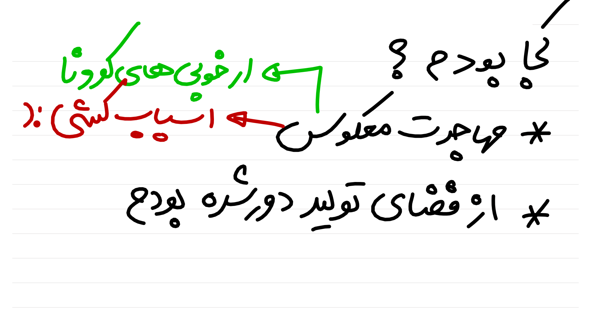
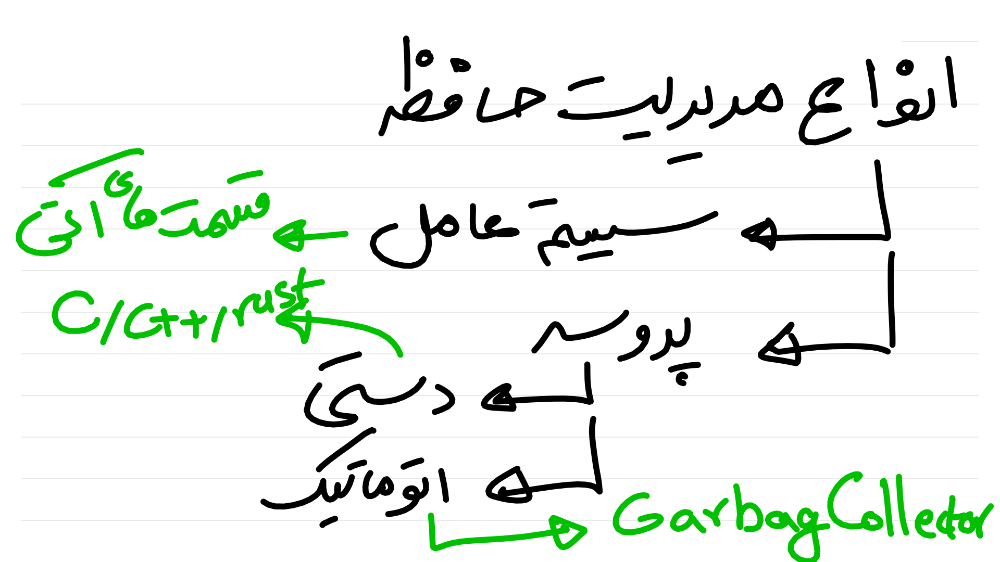

:title: گردشی در سیستم عامل
:author: عباس یزدان پناه
:description: این سری ارائه مقدماتی در مورد سیستم عامل است
:keywords: presentation, youtube, os, crash course
:css: os.css

----

:data-x: r2000

.. image:: images/page1.svg
	:width: 100%

----

----

----

----

:data-x: r0
:data-y: r1080

نمونه کد در سی!
===========================================

.. code:: C

    #include <stdio.h>
    #include <stdlib.h>

    int main(void)
    {
        int a; // stack
        int *b = malloc(10 * sizeof(int)); // heap
        free(b);
        return 0;
    }
    
----

نمونه کد در جاوا!
======================

.. code:: java

    package org.abyz.test;

    public class Memory {

	    public static void main(String[] args) { 
		    int i=1; // stack
		    Object obj = new Object(); // heap
	    } 

    }

----

نمونه کد در سی‌شارپ!
======================

.. code:: c#

    namespace abyz
    {
        class Program
        {
            static int Main()
            {
                int a = 0; // stack
                StringBuilder strb1 = 
                    new StringBuilder("Obj1"); // heap
            }
        }    
    }

---- 

در پایتون و جاوااسکریپت
============================

* همه چیز در heap تعریف می‌شود
* وابسته به پیاده‌سازی است
    - بسته به اینکه V8 باشد یا spider monkey
    - بسته به اینکه Cpython باشد یا JPython یا ...

----

:data-x: r2000
:data-y: 0

----

:data-x: r0
:data-y: r1080

نمونه کد در سی! غایب حاضر
===========================================

.. code:: C

    int bad(int *a) { free(a); }
    int main(void)
    {
        int *b = malloc(10 * sizeof(int)); 
        bad(b);
        // b is dangling pointer
        return 0;
    }
    

----

نمونه کد در سی! حاضر غایب
===========================================

.. code:: C

    int main(void)
    {
        int *b = malloc(10 * sizeof(int)); 
        b = malloc(2 * sizeof(int)); // memory leak
        return 0;
    }

----

:data-x: r2000
:data-y: 0

----

:data-x: r0
:data-y: r1080

----

:data-x: r2000
:data-y: 0

