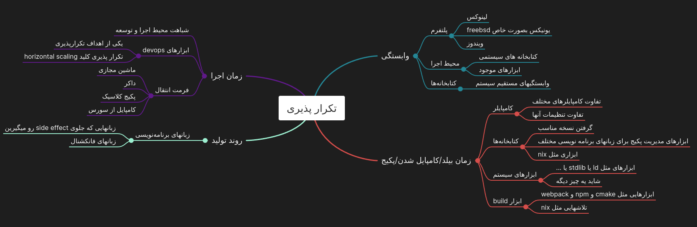

:title: تکرار پذیری بخش اول
:author: عباس یزدان پناه
:description: این سری ارائه در مورد تکرارپذیری در it و نرم‌افزار است
:keywords: presentation, youtube, os, crash course
:css: reproducibility.css

----

:data-x: r2500

.. raw:: html

  <h2>باسمه تعالی</h2>

تکرار پذیری بخش اول
=========================================================

عباس یزدان‌پناه 
------------------------------

----

فهرست
===========================================

- منظور از تکرارپذیری چیست؟
- نقشه ذهنی

----

منظور از تکرار پذیری چیست؟
===========================================

- زندگی با حداقل انرژی
- آشوب و آنتروپی و عدم قطعیت
- عدم قطعیت پایین = انرژی کمتر
- تکرارپذیری نشانه عدم قطعیت پایین

----

بازتولید و تکرار پذیری
===========================================

- این دو کلمه به جای یکدیگر به‌کار رفته اند
- ریشه در روش تحقیق و آزمایشهای علمی دارند
- قابلیت تکرار و بازتولید نتایج آزمایش یا فرضیه با درجه خوبی از اطمینان

----

تکراری پذیری در IT
===========================================

- حوزه‌های مختلف تلاش بر تکرار پذیر کردن دارند
- هدف از تکرارپذیر بودن، ایجاد ثبات در ارائه خدمات است
- هدف نهایی کاهش هزینه‌های تولید و نگهداری

----

عواملی که منجر به تکرارناپذیری می‌شوند
===========================================

- پیچیدگی
- تغییرات کنترل نشده
- عوارض یا side effects
- وابستگی

----

دسته بندی عوامل
===========================================

- عوامل مربوط به پلتفرم
- عوامل مربوط به زمان اجرا
- عوامل مرتبط با سخت‌افزار
- عوامل خارجی/فورس‌ماژور

----

وابستگی
===========================================

- پلتفرم
	* سیستم عامل
	* معماری cpu
	* سخت‌افزار
- محیط اجرا
	* کتابخانه‌های سیستمی
	* ابزارهای موجود
- کتابخانه‌ها
	* وابستگی‌های مستقیم نرم‌افزار
	* ابزار توسعه

----

فرازی به فرق ویندوز و لینوکس و FreeBSD
===========================================

- رویکرد متفاوت سیستم عاملها به کنترل وابستگی
- لینوکس
- FreeBSD
- Windows

----
