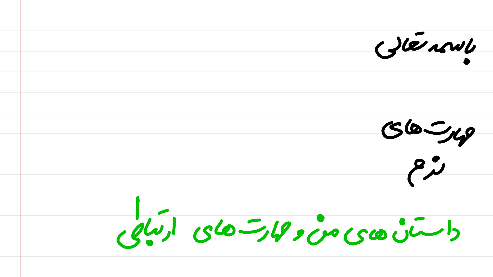
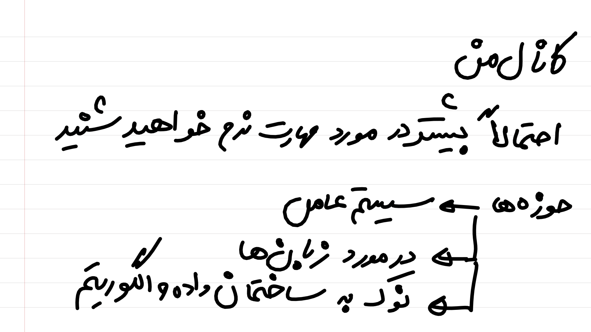
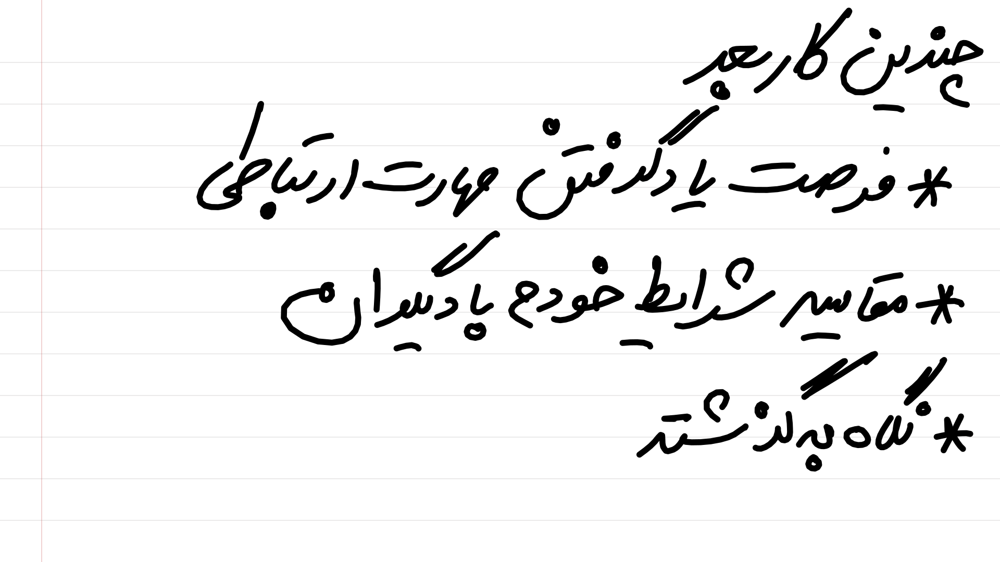
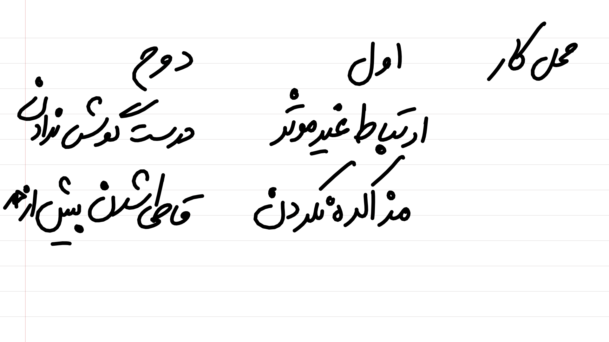
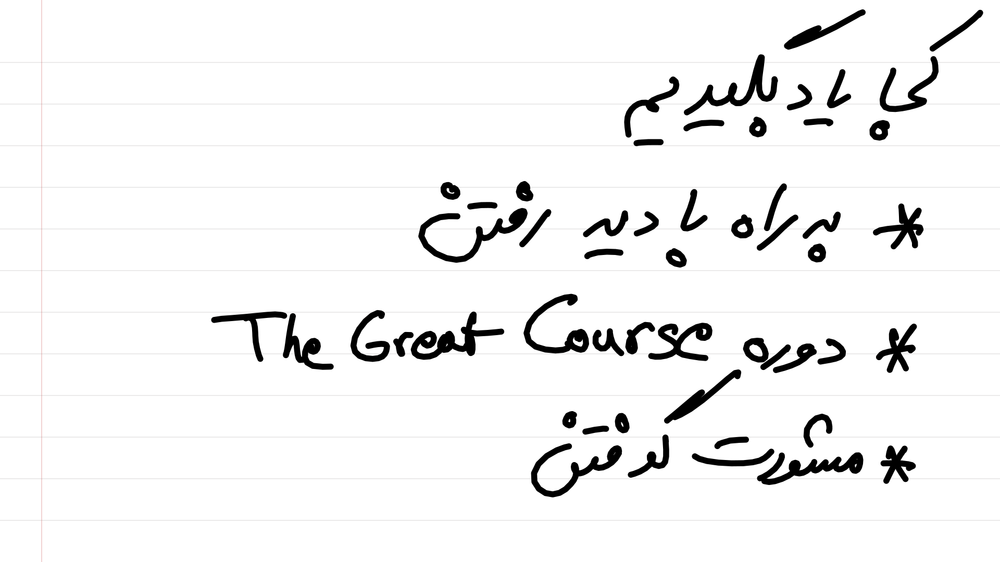
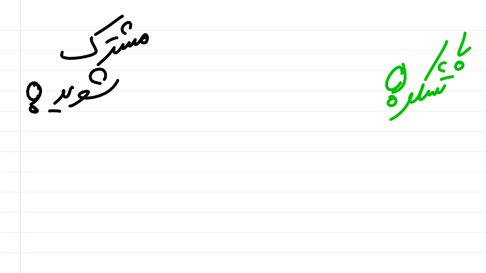

:title: گردشی در سیستم عامل
:author: عباس یزدان پناه
:description: این سری ارائه مقدماتی در مورد سیستم عامل است
:keywords: presentation, youtube, os, crash course
:css: softskills.css

----

:data-x: r2000

----

----

.. raw:: html

    <object data="images/commiunication-skills/3/page.svg" type="image/svg+xml" width=100%>
    </object>

----

:data-x: r0
:data-y: r1080

.. raw:: html

    <object data="images/commiunication-skills/4/page.svg" type="image/svg+xml" width=100%>
    </object>

----

----

:data-x: r2000
:data-y: 0

----

----

